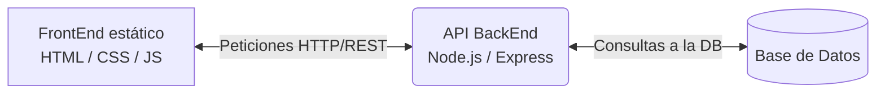
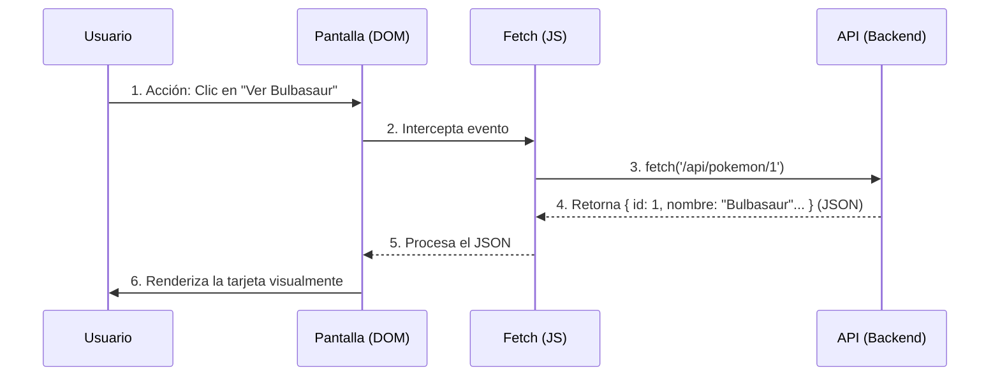

# Pokédex Virtual - Proyecto Web 🔴⚪

Este repositorio contiene el desarrollo del proyecto "Pokédex", correspondiente a la materia de **Programación Web I (INF240)**. Actualmente, el proyecto abarca la maquetación estática (HTML/CSS) y el diseño inicial de la arquitectura Backend que servirá como base para la materia INF340.

## 👥 Equipo de Desarrollo
* **Pierre Plantarrosa Bejarano**
* **Pither Daniel Condori Villanueva**
* **Grupo:** #002

## 🌐 Enlace del Proyecto
La versión estática y maquetada del proyecto se encuentra desplegada y visible en el servidor de la materia:
👉 `http://tecnoweb.org.bo/inf240/grupo02sx/`

---

## 🛠️ Tecnologías y Herramientas (Etapa 1: FrontEnd Estático)
* **HTML5:** Uso riguroso de etiquetas semánticas (`<header>`, `<nav>`, `<main>`, `<section>`, `<article>`, `<footer>`).
* **CSS3:** 
  * Diseño 100% responsivo sin depender exclusivamente de *media queries*.
  * Uso de **Flexbox** para la alineación fluida de la barra de navegación.
  * Uso de **CSS Grid** (`auto-fit`, `minmax`) para la grilla de las tarjetas de los Pokémon.

---

## 🧠 Vida del proyecto (JavaScript)
* **JavaScript:** Uso del DOM mediante JavaScript, manejo de eventos e interacción, control de modo oscuro, control de pokemones favoritos (`getElementById`, `querySelectorAll`, `forEach`, `addEventListener`, `contains`, `toggle`, `display`).

---

## ⚙️ Diseño de BackEnd (Planificación para INF340)

### 1. Entidad Central (Recurso)
El recurso principal de nuestra API REST es la entidad **`pokemon`**.

### 2. Lenguaje y Arquitectura
Para la futura implementación del servidor se ha elegido **JavaScript** (utilizando Node.js y Express). Esta tecnología aporta flexibilidad y facilita la estructuración de la lógica bajo el patrón **Modelo-Vista-Controlador (MVC)**, permitiendo además mantener un entorno de desarrollo unificado (Full-Stack JavaScript) junto con el FrontEnd.

### 3. Endpoints (CRUD)
Se han definido las siguientes rutas para la gestión del catálogo:

| Método | Endpoint | Descripción |
|---|---|---|
| `GET` | `/api/pokemon` | Obtiene la lista completa de Pokémon (soporta paginación). |
| `GET` | `/api/pokemon/{id}` | Obtiene los detalles de un Pokémon específico por su ID. |
| `POST` | `/api/pokemon` | Registra un nuevo Pokémon en la base de datos. |
| `PUT` | `/api/pokemon/{id}` | Actualiza completamente los datos de un Pokémon existente. |
| `DELETE` | `/api/pokemon/{id}` | Elimina un Pokémon del registro. |

### 4. Estructura de Respuesta JSON
Ejemplo de la respuesta que devolverá el endpoint `GET /api/pokemon/1`:

```json
{
  "id": 1,
  "nombre": "Bulbasaur",
  "tipos": ["Planta", "Veneno"],
  "estadisticas": {
    "hp": 45,
    "ataque": 49,
    "defensa": 49,
    "velocidad": 45
  },
  "imagen_url": "https://raw.githubusercontent.com/PokeAPI/sprites/master/sprites/pokemon/1.png",
  "descripcion": "Una extraña semilla fue plantada en su espalda al nacer."
}
```

---

## 🏗️ Arquitectura del Proyecto (Etapa 2)

### 1. Diagrama Cliente-Servidor
El siguiente esquema ilustra la comunicación entre las tres capas principales de la aplicación:



### 2. Flujo de Datos
Recorrido detallado de una petición típica desde la interfaz hasta la pantalla:


## 🎨 Mini Guía de Estilo (UI/UX) (Etapa 3)

Esta sección define las decisiones de diseño para el proyecto, sirviendo como insumo para el prototipado en Figma (Etapa 2).

### 1. Análisis de Interfaz de Referencia
* **Web evaluada:** [Ejemplo: Página oficial de Pokedex.com o Wikidex]
* **Qué funciona (UX/UI):** El uso de colores sólidos y representativos para identificar rápidamente los tipos de Pokémon. Las imágenes grandes facilitan el reconocimiento visual inmediato.
* **Qué no funciona:** En algunas wikis, la sobrecarga de tablas y estadísticas de combate en la primera vista satura la pantalla, dificultando la lectura en dispositivos móviles.

### 2. Paleta de Colores y Roles
Se definieron los siguientes colores, verificando el contraste de los textos sobre los fondos utilizando herramientas de accesibilidad (WebAIM/Lighthouse).
* **Primario (Rojo Pokédex):** `#ef5350` — Rol: Encabezados (Header) y elementos de marca.
* **Secundario / Acento:** `#ffcb05` — Rol: Efectos *hover* en enlaces para indicar interactividad.
* **Fondo Principal:** `#f4f5f7` — Rol: Color base para descansar la vista en el cuerpo de la página.
* **Superficies (Tarjetas):** `#ffffff` — Rol: Contenedor para destacar a cada Pokémon individualmente.
* **Texto Principal:** `#2c3e50` / `#333333` — Rol: Títulos y cuerpo de texto (alto contraste sobre fondos claros).

### 3. Tipografía y Escala
Se seleccionó la familia tipográfica sin serifas **'Segoe UI', Tahoma, sans-serif** para garantizar una lectura limpia y moderna en pantallas digitales.
* **H1 (Título de Página):** 2rem (Negrita) — Uso: "Pokédex Virtual".
* **H2 (Subtítulos de Sección):** 1.5rem (Seminegrita) — Uso: Mensajes de bienvenida y divisiones.
* **H3 (Nombres de Entidades):** 1.17rem (Negrita) — Uso: Nombre de cada Pokémon en su tarjeta.
* **Cuerpo (Body / P):** 1rem (Regular) — Uso: Párrafos descriptivos.
* **Textos secundarios (Tipos):** 0.9rem (Regular) — Uso: Etiquetas de tipos (ej. Planta/Veneno) en color gris (`#7f8c8d`).

### 4. Jerarquía Visual (Vista Clave: Tarjeta de Pokémon)
En la cuadrícula de la Pokédex, el ojo del usuario es guiado intencionalmente en el siguiente orden de lectura:
1. **Primer nivel de atención:** La **imagen** del Pokémon (ubicada al centro, con un tamaño predominante de 120x120px).
2. **Segundo nivel de atención:** El **número y nombre** del Pokémon (etiqueta H3, con un color oscuro que contrasta con la tarjeta blanca).
3. **Tercer nivel de atención:** Los **tipos** del Pokémon (texto más pequeño y en color gris tenue, sirviendo como información complementaria).

## 🖌️ Prototipado en Figma (Etapa 4)

Como parte de la Etapa 2, se diseñó un prototipo interactivo que sirve como entregable de diseño y será el plano principal para la futura construcción del proyecto utilizando React[cite: 6].

### Enlace al Prototipo
🔗 **https://www.figma.com/design/sibBlzyt5Xu9Kle1vGMCuz/Proyecto-Pokedex?node-id=0-1&t=TfcPuCkKn3z66wau-1**

### Resumen del Diseño
Siguiendo las directrices del proyecto, el archivo de Figma incluye:
1. **Estilos Locales:** Se registraron la paleta de colores y la escala tipográfica documentadas en la Mini Guía de Estilo[cite: 6].
2. **Pantallas Diseñadas:** Se crearon mockups visuales basados en wireframes previos[cite: 6], cubriendo el flujo principal de la aplicación (Inicio, Catálogo Pokédex y Detalle).
3. **Componentes Reutilizables:** Se modularizó el diseño creando componentes base, incluyendo un botón estándar y la tarjeta de presentación de cada Pokémon[cite: 6].
4. **Navegación Interactiva:** Se configuró el modo *Prototype* para enlazar las pantallas, permitiendo simular la experiencia de usuario y el flujo de navegación[cite: 6].
