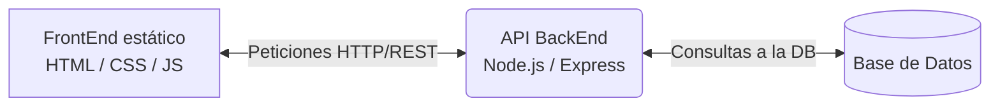
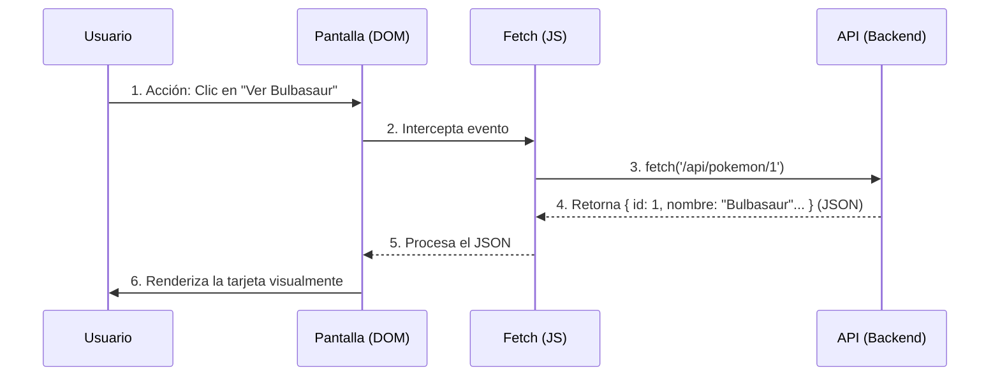

# Pokédex Virtual - Proyecto Web 🔴⚪

Este repositorio contiene el desarrollo del proyecto "Pokédex", correspondiente a la materia de **Programación Web I (INF240)**. Actualmente, el proyecto abarca la maquetación estática (HTML/CSS) y el diseño inicial de la arquitectura Backend que servirá como base para la materia INF340.

## 👥 Equipo de Desarrollo
* **Pierre Plantarrosa Bejarano**
* **Pither Daniel Condori Villanueva**
* **Grupo:** #002

## 🌐 Enlace del Proyecto
La versión estática y maquetada del proyecto se encuentra desplegada y visible en el servidor de la materia:
👉 `http://tecnoweb.org.bo/inf240/grupo02sx/`

---

## 🛠️ Tecnologías y Herramientas (Etapa 1: FrontEnd Estático)
* **HTML5:** Uso riguroso de etiquetas semánticas (`<header>`, `<nav>`, `<main>`, `<section>`, `<article>`, `<footer>`).
* **CSS3:** 
  * Diseño 100% responsivo sin depender exclusivamente de *media queries*.
  * Uso de **Flexbox** para la alineación fluida de la barra de navegación.
  * Uso de **CSS Grid** (`auto-fit`, `minmax`) para la grilla de las tarjetas de los Pokémon.

---

## 🧠 Vida del proyecto (JavaScript)
* **JavaScript:** Uso del DOM mediante JavaScript, manejo de eventos e interacción, control de modo oscuro, control de pokemones favoritos (`getElementById`, `querySelectorAll`, `forEach`, `addEventListener`, `contains`, `toggle`, `display`).

---

## ⚙️ Diseño de BackEnd (Planificación para INF340)

### 1. Entidad Central (Recurso)
El recurso principal de nuestra API REST es la entidad **`pokemon`**.

### 2. Lenguaje y Arquitectura
Para la futura implementación del servidor se ha elegido **JavaScript** (utilizando Node.js y Express). Esta tecnología aporta flexibilidad y facilita la estructuración de la lógica bajo el patrón **Modelo-Vista-Controlador (MVC)**, permitiendo además mantener un entorno de desarrollo unificado (Full-Stack JavaScript) junto con el FrontEnd.

### 3. Endpoints (CRUD)
Se han definido las siguientes rutas para la gestión del catálogo:

| Método | Endpoint | Descripción |
|---|---|---|
| `GET` | `/api/pokemon` | Obtiene la lista completa de Pokémon (soporta paginación). |
| `GET` | `/api/pokemon/{id}` | Obtiene los detalles de un Pokémon específico por su ID. |
| `POST` | `/api/pokemon` | Registra un nuevo Pokémon en la base de datos. |
| `PUT` | `/api/pokemon/{id}` | Actualiza completamente los datos de un Pokémon existente. |
| `DELETE` | `/api/pokemon/{id}` | Elimina un Pokémon del registro. |

### 4. Estructura de Respuesta JSON
Ejemplo de la respuesta que devolverá el endpoint `GET /api/pokemon/1`:

```json
{
  "id": 1,
  "nombre": "Bulbasaur",
  "tipos": ["Planta", "Veneno"],
  "estadisticas": {
    "hp": 45,
    "ataque": 49,
    "defensa": 49,
    "velocidad": 45
  },
  "imagen_url": "https://raw.githubusercontent.com/PokeAPI/sprites/master/sprites/pokemon/1.png",
  "descripcion": "Una extraña semilla fue plantada en su espalda al nacer."
}
```

---

## 🏗️ Arquitectura del Proyecto (Etapa 2)

### 1. Diagrama Cliente-Servidor
El siguiente esquema ilustra la comunicación entre las tres capas principales de la aplicación:



### 2. Flujo de Datos
Recorrido detallado de una petición típica desde la interfaz hasta la pantalla:


